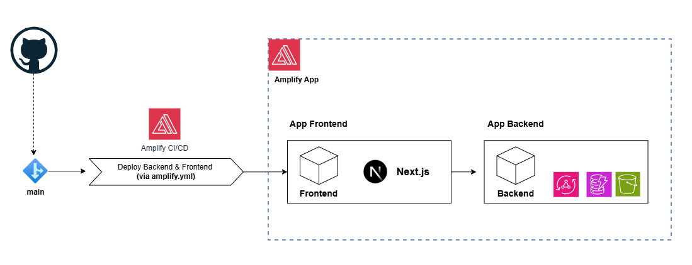
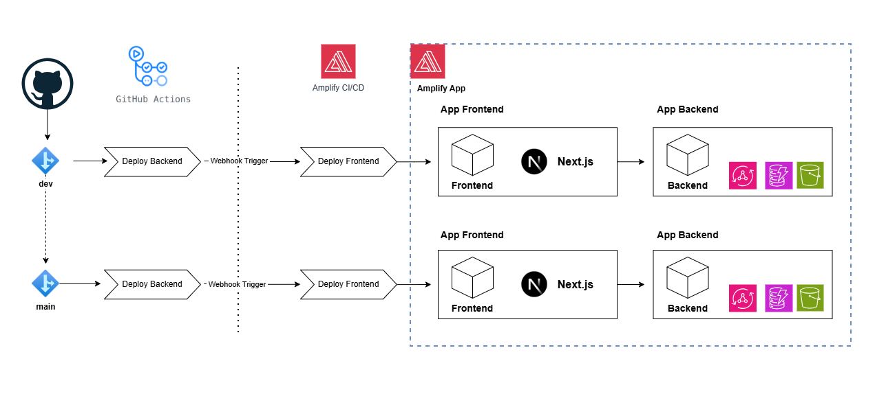
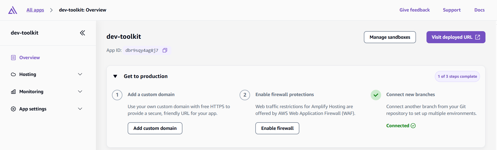
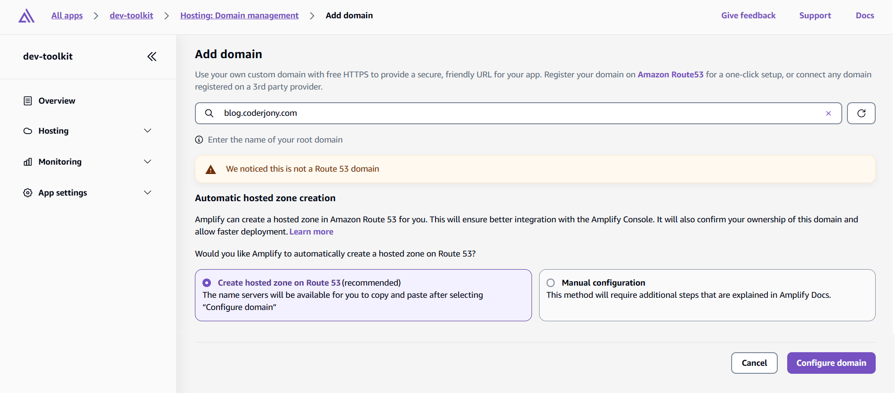

# Dev Toolkit

Dev Toolkit is a comprehensive productivity platform built with **Next.js 15** and **AWS Amplify Gen 2**. It provides a unified workspace for managing blogs, bookmarks, Notion-style notes, and Kanban boards, with auto-save functionality and a responsive design.

---

## Running the App Locally

1. Clone the repository to your local machine.
2. Run `npm install` to install dependencies.
3. Configure AWS credentials by running `aws configure` or by setting environment variables.
4. Run `npx ampx sandbox` to provision backend infrastructure in AWS.

   > When you deploy a cloud sandbox, Amplify creates an AWS CloudFormation stack following the naming convention
   > `amplify-<app-name>-<$(whoami)>-sandbox` in your AWS account, using the resources defined in the `amplify/` folder.

5. Run `npm run dev` to start the app.
6. Open `http://localhost:3000` in your browser to view the application.

---

## Deploying to AWS

There are two ways to deploy the application to AWS:

- **AWS Amplify CI/CD**
- **GitHub Actions**

> **Cost note:** Amplify charges **$0.01 per build minute**, while **GitHub Actions offers 2,000 free build minutes per month**.

Deployment includes:

- **Backend & infrastructure** (AWS CDK)
- **Frontend** (AWS Amplify)

---

### Deployment Coverage

| Deployment Method     | Backend & Infra            | Frontend                         |
| --------------------- | -------------------------- | -------------------------------- |
| **AWS Amplify CI/CD** | ✅ Deploys backend & infra | ✅ Builds & deploys              |
| **GitHub Actions**    | ✅ Deploys backend & infra | 🔔 Triggered via Amplify webhook |

---

## Deployment Option #1: Using AWS Amplify CI/CD (Easy)

> Use this option when you want Amplify to manage both backend and frontend deployments.

### CI/CD Pipeline

The project uses **Amplify CI/CD** for automated deployment.

- **Triggers**: Pushes to `main` branches.
- **Environments**: `main` is for production.
- **Backend & Frontend Deployment**: Uses `amplify.yml` to deploy backend and frontend.

---

### Architecture



---

### Steps

1. Create a fork of the repository in your GitHub account.

2. Modify the `amplify.yml` file located at the root:
   - Remove:

     ```bash
     npx ampx generate outputs --branch $AWS_BRANCH --app-id $AWS_APP_ID
     ```

   - Uncomment:

     ```bash
     npx ampx pipeline-deploy --branch $AWS_BRANCH --app-id $AWS_APP_ID
     ```

   Or replace the existing file with the following:

   ```yaml
   version: 1
   backend:
     phases:
       build:
         commands:
           - npm ci --cache .npm --prefer-offline
           - npx ampx pipeline-deploy --branch $AWS_BRANCH --app-id $AWS_APP_ID
   frontend:
     phases:
       build:
         commands:
           - npm run build
     artifacts:
       baseDirectory: .next
       files:
         - "**/*"
     cache:
       paths:
         - .next/cache/**/*
         - .npm/**/*
   ```

3. Amplify requires a service IAM role with both `AdministratorAccess-Amplify` and `AmazonDynamoDBFullAccess`.
   Create the role named `AmplifyServiceRole` using the [`scripts/create-amplify-role.sh`](scripts/create-amplify-role.sh) script, and reuse it across other Amplify apps.

4. Go to the AWS Amplify Console and create a new Amplify app:
   - **Step 1**: Select **GitHub** as the Git provider.

     

   - **Step 2**: Select the forked repository and the **main** branch.

     

   - **Step 3**: Provide an app name and select the existing role (`AmplifyServiceRole`).
     Do not choose **Create and use a new service role**, because the deployment depends on the preconfigured role with DynamoDB access.

     

   - **Step 4**: Review the settings and click **Save and deploy**.

     

   - **Step 5**: After deployment, attach the IAM role to Amplify Compute for ISR support:
     **Select Amplify App → App Settings → IAM Roles → Compute role**, then choose the same `AmplifyServiceRole`.

5. Next, refer to the **Adding Custom Domain and SSL Certificate** section below.

---

## Deployment Option #2: Using GitHub Actions (Advanced)

> Use this option when you want GitHub Actions to deploy the backend and trigger the frontend build on Amplify.

### CI/CD Pipeline

The project uses **GitHub Actions** for automated deployment across multiple environments.

- **Triggers**: Pushes to `dev` and `main` branches.
- **Environments**: `dev` is for development, `main` is for production.
- **Backend Deployment**: Uses `ampx pipeline-deploy` with branch-specific environments
- **Frontend Deployment**: Triggers an Amplify webhook for frontend builds
- **AWS Authentication**: OIDC integration for secure deployments
- **Runtime**: Node.js **24.x**, with npm caching for faster builds

---

### Architecture



---

### Steps

1. Create a fork of the repository in your GitHub account.

2. Key files in the repository:
   - [`amplify.yml`](amplify.yml): Deploys **frontend only**
   - [`.github/workflows/deploy.yml`](.github/workflows/deploy.yml): Deploys the backend and triggers the Amplify webhook
     - Commits to `main` trigger **prod** deployment
     - Commits to `develop` trigger **dev** deployment
     - Commits to other branches do not trigger deployments

3. **Amplify Application Model** (informational):
   - An Amplify app can have multiple branches.
   - Each branch represents an environment.
   - Multiple environments can exist within the same AWS account.

4. Create a reusable Amplify service IAM role using [`scripts/create-amplify-role.sh`](scripts/create-amplify-role.sh).
   The role must include both `AdministratorAccess-Amplify` and `AmazonDynamoDBFullAccess`.

5. In the AWS Amplify Console, create an Amplify app and connect the **develop** branch (dev environment):
   - **Step 1**: Select "Deploy an App" if there is no app.
   - **Step 2**: Select GitHub as the provider.

     

   - **Step 3**: Select the forked repository and the **develop** branch.

     

   - **Step 4**: Provide an app name and select the existing role (`AmplifyServiceRole`).
     Do not create a new service role in the console.

   - **Step 5**: Review and click **Save and deploy**.

   - **Step 6**: After deployment, attach the IAM role to Amplify Compute for ISR support:
     **Select Amplify App → App Settings → IAM Roles → Compute role**, then choose the same `AmplifyServiceRole`.

   - **Step 7**: Disable auto-build for the branch:
     **App settings → Branch settings → Select branch → Actions → Disable auto build**

   - **Step 8 (Optional)**: Cancel the initial pipeline from **Overview → Branch deployment page**.

     > Cancelling the initial pipeline because it only deploys the frontend and requires `amplify_outputs.json` file. Deploy the backend first so the `amplify_outputs.json` file is created and the frontend build can access backend outputs.

   - **Step 9**: Add `main` branch:
     **App settings → Branch settings → Add branch → Select main branch**

   - **Step 10**: Disable auto-build for the branch (main):
     **App settings → Branch settings → Select branch (main) → Actions → Disable auto build**

   - **Step 11**: Set `main` as production branch:
     **App settings → Branch settings → Select branch (main) → Actions → Set as production branch**

   - **Step 12**: Create webhooks: **Hosting → Build settings → Incoming webhooks → Create webhook**
     - For `develop` branch
       - **Webhook name**: `deploy-develop-branch`
       - **Branch to build**: `develop`
     - For `main` branch
       - **Webhook name**: `deploy-main-branch`
       - **Branch to build**: `main`

6. **Create an IAM role for GitHub Actions**:

- Create an OIDC provider for GitHub. Refer to the [AWS blog](https://aws.amazon.com/blogs/security/use-iam-roles-to-connect-github-actions-to-actions-in-aws/) (see "Step 1: Create an OIDC provider in your account").

- Create an IAM role (e.g., `GithubOIDCAdminRole_For_<RepoName>`) and attach the `AdministratorAccess` policy.

- Use the following trust policy (replace placeholders as needed):

  ```json
  {
    "Version": "2012-10-17",
    "Statement": [
      {
        "Effect": "Allow",
        "Principal": {
          "Federated": "arn:aws:iam::${ACCOUNT_ID}:oidc-provider/token.actions.githubusercontent.com"
        },
        "Action": "sts:AssumeRoleWithWebIdentity",
        "Condition": {
          "StringLike": {
            "token.actions.githubusercontent.com:sub": "repo:ankushjain358/dev-toolkit:*"
          }
        }
      }
    ]
  }
  ```

- Note down the IAM role ARN.

7. Add the following variables in **GitHub Actions secrets and variables**:
   Go to **Settings → Secrets and variables → Actions** in your repository to add these.
   - **Repository variables**
     - `AMPLIFY_APP_ID`

   - **Repository secrets**
     - `GH_OIDC_IAM_ROLE_ARN`

   - **Environment secrets**
     - `AMPLIFY_WEBHOOK_URL` (dev)
     - `AMPLIFY_WEBHOOK_URL` (prod)

8. Go to **GitHub Actions**, select the **Deploy Amplify Backend** workflow, choose **Run workflow**, select the branch (develop, then main), and run the workflow.

9. Next, refer to the **Adding Custom Domain and SSL Certificate** section below.

---

## Adding Custom Domain and SSL Certificate

1. Select your amplify app, select first step **Add custom domain** under **Go to production**.
2. On next page, select Add domain.
3. On next page, enter domain name and click on **Check domain availability**.
4. Next, proceed with either **Create hosted zone on Route 53** or **Manual configuration**.
5. In subsequent steps, you will get instructions to setup domain and **Amplify managed certificate**.

---

## Tech Stack

### Frontend

- **Next.js 15** (App Router, Turbopack)
- **React 19** with TypeScript
- **Tailwind CSS v4**
- **Shadcn UI**
- **Tiptap** rich text editor
- **TanStack Query**
- **React Hook Form** with Zod validation

### Backend

- **AWS Amplify Gen 2**
- **Amazon DynamoDB** with GSIs
- **Amazon S3** with CloudFront
- **Amazon Cognito**
- **AWS AppSync** (GraphQL)

### Development & CI/CD

- **GitHub Actions**
- **ESLint & Prettier**
- **Husky**
- **Multi-environment deployments** (dev / stage / prod)

---

## Coding Assistant – Project Context Files

- `.github/copilot-instructions.md`
- `AmazonQ.md`

---

## Code Quality & Hooks ✅

To keep the codebase consistent and maintainable, the project uses:

- **ESLint** for static analysis and rule enforcement
- **Prettier** for automatic code formatting
- **Husky + lint-staged** to run checks on staged files before commits

### Running Hooks / Tools Manually

- Run pre-commit hooks manually:

  ```bash
  git hook run pre-commit
  ```

- Format the repository:

  ```bash
  npx prettier . --write
  ```

  Scope formatting if needed:

  ```bash
  prettier --write app/
  prettier --write app/components/Button.js
  ```

- Run ESLint with auto-fix:

  ```bash
  eslint . --fix
  ```

> Tip: Run `npx prettier . --write` followed by `eslint . --fix` before committing.

---

## Key Technical Decisions

1. Blog images are served via CloudFront using the `/public` prefix, which redirects requests to S3.
2. The BlocknoteJS editor inherits CSS from its parent, allowing font size control.
3. **Amplify Data API**
   - The app uses model-level authorization rules and falls back to global authorization rules when model-level rules are not defined. Refer to [Available authorization strategies](https://docs.amplify.aws/nextjs/build-a-backend/data/customize-authz/).
   - When creating a new `Blogs` item with `allow.owner()`, Amplify automatically adds an `owner` field (not visible in the schema) and sets it to the authenticated user’s Cognito `sub`. This ensures users can only create and access their own items.

## TODO

1. Document: Branching and deployment environment relation

```
devlop -> dev
main -> prod
```

2. Updated diagram
3. Fix TODOs
4. MOve scripts inside scripts directory
5. Add steps for Custom domain and SSL certificate
6. Copy blog data from dev account and delete the stack
7. Check by creating Amplify Service Role by that script again (It seems that doesn't attaches AdministratorAccess-Amplify managed policy)
8. Add step to create user in Cognito
9. Copy dummy amplify_outputs.json in github actions to perform early build
