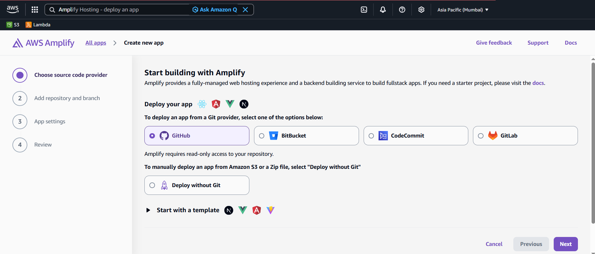
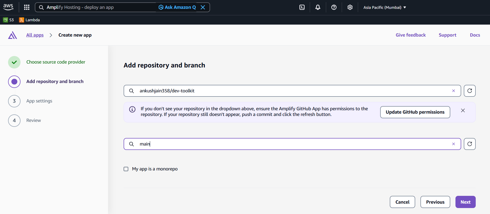
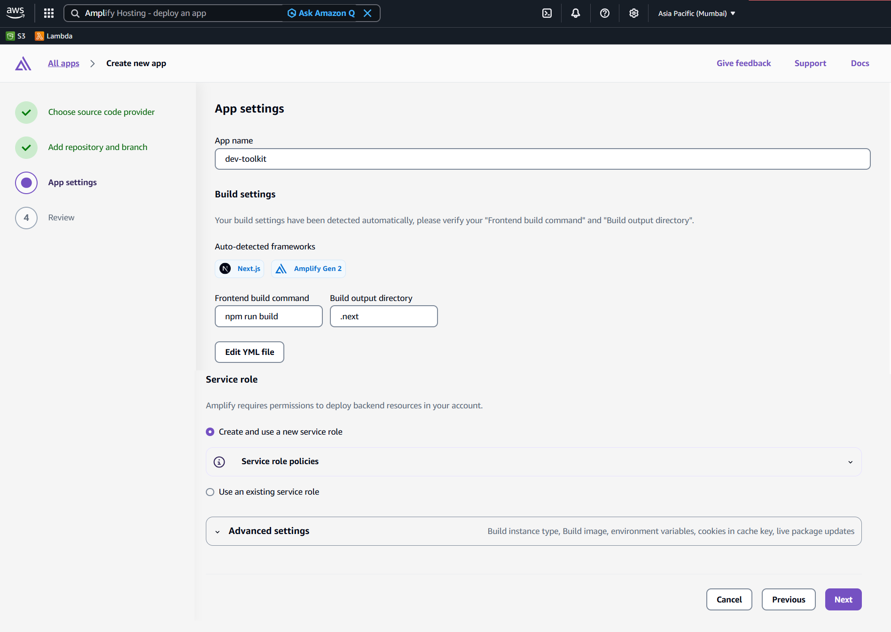
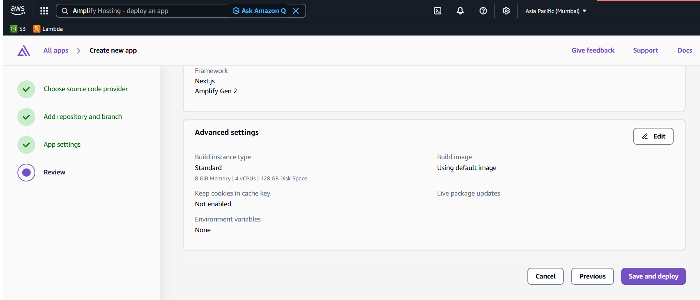
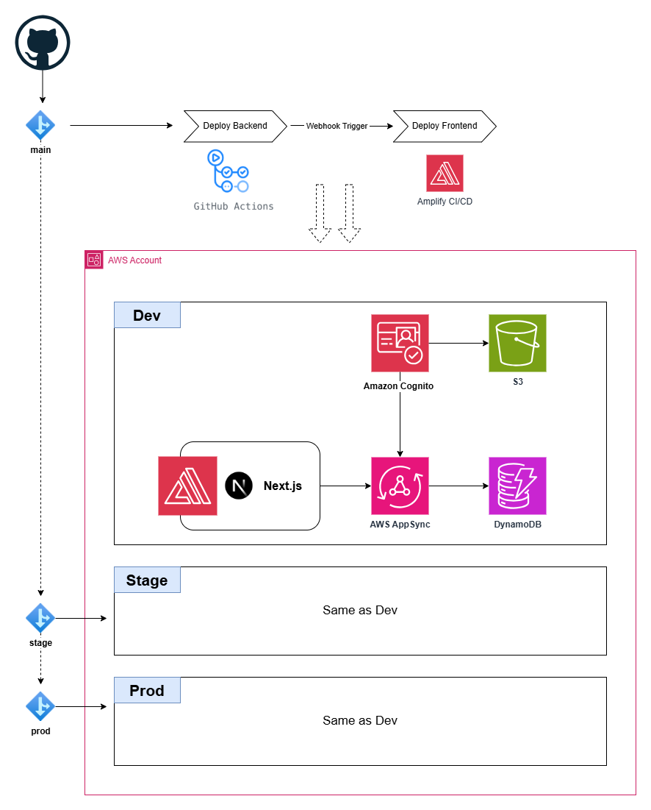

# Dev Toolkit

Dev Toolkit is a comprehensive productivity platform built with Next.js 15 and AWS Amplify Gen 2. It provides a unified workspace for managing blogs, bookmarks, Notion-style notes, and Kanban boards with auto-save functionality and responsive design.

## Running App Locally

1. Clone the repository on your local machine.
2. Run `npm install` to install dependencies.
3. Configure AWS credentials by running `aws configure` or setting environment variables.
4. Run `npx ampx sandbox` to provision backend infra in AWS.
   > When you deploy a cloud sandbox, Amplify creates an AWS CloudFormation stack following the naming convention of `amplify-<app-name>-<$(whoami)>-sandbox` in your AWS account with the resources configured in your amplify/ folder.
5. Run `npm run dev` to run the app.
6. Open `http://localhost:3000` with your browser to see the result.

## CI/CD Pipeline

The project uses GitHub Actions for automated deployment across multiple environments:

- **Triggers**: Push to `main` (dev), `stage`, or `prod` branches
- **Backend Deployment**: Uses `ampx pipeline-deploy` with branch-specific environments
- **Frontend Deployment**: Triggers Amplify webhook for frontend build
- **AWS Authentication**: OIDC integration for secure deployments
- **Node.js 24.x** runtime with npm caching for faster builds

## Deploying to AWS

There are two ways to deploy the application on AWS:

- **AWS Amplify CI/CD**
- **GitHub Actions**

> **Cost note:** Amplify charges **$0.01 per build minute**, while **GitHub Actions offers 2,000 free build minutes per month**.

Deployment includes:

- **Backend & infrastructure** (AWS CDK)
- **Frontend** (AWS Amplify)

### Deployment Coverage

| Deployment Method     | Backend                    | Frontend                         |
| --------------------- | -------------------------- | -------------------------------- |
| **AWS Amplify CI/CD** | ✅ Deploys backend & infra | ✅ Build & deploy                |
| **GitHub Actions**    | ✅ Deploys backend & infra | 🔔 Triggered via Amplify webhook |

### Deployment Option #1 (Easy) - Using AWS Amplify CI/CD

> Use this when you want Amplify to manage both backend and frontend deployments.

Follow the step by step process:

1. Create a fork of the repository in your GitHub account.

2. Modify the `amplify.yml` filelocated on the root.
   - Remove `npx ampx generate outputs --branch $AWS_BRANCH --app-id $AWS_APP_ID`
   - Uncomment `npx ampx pipeline-deploy --branch $AWS_BRANCH --app-id $AWS_APP_ID`

   Or, copy the below one and replace the eixtsing file.

   ```yaml
   version: 1
   backend:
     phases:
       build:
         commands:
           - npm ci --cache .npm --prefer-offline
           - npx ampx pipeline-deploy --branch $AWS_BRANCH --app-id $AWS_APP_ID
   frontend:
     phases:
       build:
         commands:
           - npm run build
     artifacts:
       baseDirectory: .next
       files:
         - "**/*"
     cache:
       paths:
         - .next/cache/**/*
         - .npm/**/*
   ```

3. (Optional) Amplify service would need an Service IAM Role, I would recommend creating one and use it across apps. Refer [create-amplify-role.sh](docs/create-amplify-role.sh) script to create new role.

4. Go to AWS Amplify Console, and create an Amplify by following the steps give below.
   - Step 1 - Create new Amplify app, select GitHub as Git provider.

     

   - Step 2 - Select the forked repository, and **main** as branch

     

   - Step 3 - Provide app name, and select either the role (AmplifyServiceRole) you created above or select **Create and use anew service role**

     

   - Step 4 - Review the settings, and press **Save and deploy**

     

5. Next, refer **Adding Custom Domain and SSL Certificate** section below. (TODO)

### Deployment Option #2 - Using GitHub Actions

> Use this when you want GitHub Actions to deploy the backend and trigger the frontend build on Amplify.

1. Create a fork of the repository in your GitHub account.

1. You have 2 important files in the repository.

- [amplify.yml](amplify.yml) on root deploys only frontend.
- [.github\workflows\deploy.yml](.github\workflows\deploy.yml) deploys the backend and invokes Amplify WebHook to trigger frontend deployment.
  - Commit to `main` branch will trigger deployment for prod environment
  - Commit to `develop` branch will trigger deployment for dev environment
  - Commit to any other branch will not trigger any deployment

1. Amplify Application Model (Information only section)

- In Amplify App, we can add multiple branches to an Amplify app.
- Each branch acts as an environment.
- Which means, you can have multiple environments on the same AWS account.

1. (Optional) Amplify service would need an Service IAM Role, I would recommend creating one and use it across apps. Refer [create-amplify-role.sh](docs/create-amplify-role.sh) script to create new role.

1. Go to AWS Amplify Console, and create an Amplify by following the steps give below.

   > In this step, we're just connecting **develop** branch (dev environment)

- Step 1 - Create new Amplify app, select GitHub as Git provider.

  

- Step 2 - Select the forked repository, and **develop** as branch

  

- Step 3 - Provide app name, and select either the role (AmplifyServiceRole) you created above or select **Create and use a new service role**

  

- Step 4 - Review the settings, and press **Save and deploy**

  

- Step 5 - **Disable Auto-build** for your branch. Go to **App settings > Branch settings > Select branch > Actions (Disable auto build)**. This ensures code commits to your branch will not trigger a build in Amplify.

- Step 6 - (Optional) Cancel the initial pipeline - **Go to Overview > Select Branch > Branch deployment page (cancel running pipeline from here)**

- Step 7 - Create a webhook URL, go to **Hosting > Build settings > Create webhook**, and copy the URL which we will use later.
  - 1. **Webhook name:** deploy-develop-branch
  - 2. **branch to build**: develop

- Step 8 - Go to **App settings > Branch settings > Add branch**, add **main**, and also generate a webhook URL for **main** branch.
  - 1. **Webhook name:** deploy-main-branch
  - 2. **branch to build**: main

1. Creating IAM role for the GitHub repository (GitHub actions for the repository)
   - Create an OIDC provider for GitHub in your AWS account. Refer [AWS blog](https://aws.amazon.com/blogs/security/use-iam-roles-to-connect-github-actions-to-actions-in-aws/).

   - Create an IAM role (i.e. `GithubOIDCAdminRole_For_<RepoName>`) and attach `AdministratorAccess` IAM policy.

   - Use the following trust policy. Replace `${ACCOUNT_ID}`, and repo name to yours instead of `repo:ankushjain358/dev-toolkit:*`.
     ```json
     {
       "Version": "2012-10-17",
       "Statement": [
         {
           "Effect": "Allow",
           "Principal": {
             "Federated": "arn:aws:iam::${ACCOUNT_ID}:oidc-provider/token.actions.githubusercontent.com"
           },
           "Action": "sts:AssumeRoleWithWebIdentity",
           "Condition": {
             "StringLike": {
               "token.actions.githubusercontent.com:sub": "repo:ankushjain358/dev-toolkit:*"
             }
           }
         }
       ]
     }
     ```
   - Note down the IAM role ARN to assume.

1. Add following variables in **GitHub Actions secrets and variables** for each environment.
   1. **_Repository variables_**
      1. _AMPLIFY_APP_ID_
   2. **_Repository secrets_**
      1. _GH_OIDC_IAM_ROLE_ARN_
   3. **_Environment secrets_**
      1. _AMPLIFY_WEBHOOK_URL (dev)_
      1. _AMPLIFY_WEBHOOK_URL (prod)_

1. Go to GitHub actions, select the **deploy** workflow, select the branch and deploy. (TODO)

## Architecture



## Tech Stack

### Frontend

- **Next.js 15** with App Router and Turbopack
- **React 19** with TypeScript
- **Tailwind CSS v4** for styling
- **ShadcnUI** component library
- **Tiptap** rich text editor
- **TanStack Query** for state management
- **React Hook Form** with Zod validation

### Backend

- **AWS Amplify Gen 2** for backend infrastructure
- **Amazon DynamoDB** with GSI for data storage
- **Amazon S3** with CloudFront for file storage
- **Amazon Cognito** for authentication
- **AWS AppSync** GraphQL API

### Development & CI/CD

- **GitHub Actions** for automated deployment
- **ESLint & Prettier** for code quality
- **Husky** for pre-commit hooks
- **Multi-environment deployment** (dev/stage/prod)

## Coding Assistant - Project context files

- `.github\copilot-instructions.md`
- `AmazonQ.md`

## Code Quality & Hooks ✅

To keep code consistent and maintainable, this project uses the following tools:

- **ESLint** - static code analysis to catch problems and enforce code style rules.
- **Prettier** - automatic code formatting to keep formatting consistent across the project.
- **Husky + lint-staged** - runs linters and Prettier on changed files as a pre-commit hook, ensuring only linted/formatted files are committed.

### Running hooks / tools manually

- Run the pre-commit hooks manually:

  ```bash
  git hook run pre-commit
  ```

- Format the repository (warning: may take a while for larger projects):

  ```bash
  npx prettier . --write
  ```

  You can scope formatting to a directory or file to save time, e.g.:

  ```bash
  prettier --write app/
  prettier --write app/components/Button.js
  ```

- Run ESLint with auto-fix:

  ```bash
  eslint . --fix
  ```

> Tip: Run `npx prettier . --write` followed by `eslint . --fix` to format and fix code before committing.

## Key Technical Decisions

1. For blog images, CloudFront is configured with `/public` prefix to redirect requests to S3.
2. BlocknoteJS editor inherits CSS from parent, so you can control font size.
3. Amplify Data API
   - The app uses model level authorization rules, and fallsback on global level authorization rule when a model does not have a model-level authorization rule. Refer [Available authorization strategies](https://docs.amplify.aws/nextjs/build-a-backend/data/customize-authz/)
   - When you create a new Blogs item with `allow.owner()` Amplify automatically adds an owner field to your model (even though you don't see it in the schema), and set its value to the current authenticated user's Cognito sub (user identifier). Which means, user can only create items where they will be the owner.
